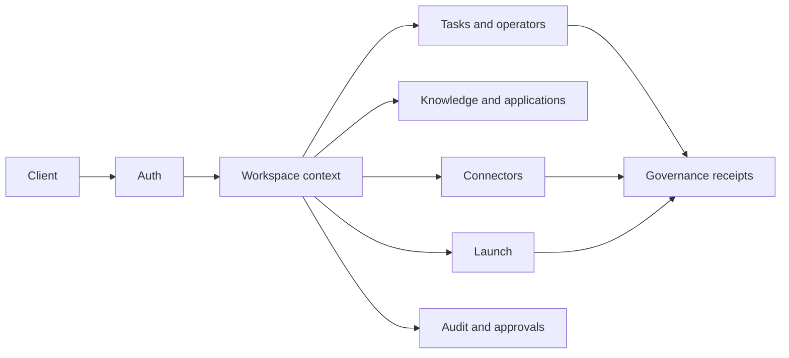

# Pilot API Reference

Base URL: `http://localhost:3100` (or your deployed gateway URL)

## Audience

Use this page if you are writing a client, testing a self-hosted deployment, wiring a connector, or auditing API behavior. It is a public reference hub for routes, auth, workspace context, payload shapes, job surfaces, receipts, and diagnostics.

## Outcome

After this page you should be able to:

- authenticate with email, Telegram, or API keys;
- pass workspace context correctly;
- use tasks, operators, knowledge, applications, connectors, launch, YC ingestion, and audit endpoints;
- understand where HELM governance receipts appear;
- collect useful diagnostics when an API call fails.

## API Surface Map



## Source Truth

Route behavior is backed by `services/gateway/src/routes/`, Zod payloads and shared types in `packages/shared/`, database domains in `packages/db/src/schema/`, and HELM receipt wiring in `packages/helm-client/`. If a route description differs from code or tests, update this file.

## Authentication

All protected endpoints require one of:

- **Bearer token:** `Authorization: Bearer <session-token>`
- **API key:** `X-API-Key: hp_<key>`
- **Workspace context:** authenticated non-auth routes should also include `X-Workspace-Id: <workspace-id>` when the workspace is not already encoded in the path.

Session tokens are obtained via `/api/auth/email/request` + `/api/auth/email/verify` or `/api/auth/telegram`.

Session tokens rotate automatically after 24 hours — check the `X-New-Token` response header.

---

## Auth

### POST /api/auth/email/request

Request a magic link code.

```json
{ "email": "you@example.com" }
```

Response: `{ "sent": true, "email": "...", "code": "123456" }` (code only in dev mode)

### POST /api/auth/email/verify

Verify magic link code and get a session.

```json
{ "email": "you@example.com", "code": "123456" }
```

Response: `{ "token": "...", "user": { "id", "name", "email" }, "workspace": { "id", "name" } }`

### POST /api/auth/telegram

Authenticate via Telegram Web App initData.

```json
{ "initData": "<telegram-web-app-init-data>" }
```

### POST /api/auth/apikey

Create an API key (requires auth).

```json
{ "name": "my-key" }
```

Response: `{ "key": "hp_...", "name": "...", "expiresAt": "..." }`

### DELETE /api/auth/session

Logout / invalidate current session.

### POST /api/auth/invite/:token

Accept a workspace invite.

```json
{ "email": "you@example.com" }
```

---

## Workspace

### GET /api/workspace/:id

Get workspace details with members.

### GET /api/workspace/:id/settings

Get workspace settings (policy, budget, model config).

### PUT /api/workspace/:id/settings

Update workspace settings.

```json
{
  "policyConfig": { "maxIterationBudget": 50, "blockedTools": [] },
  "budgetConfig": { "monthlyLlmBudget": 100, "currency": "USD" },
  "modelConfig": {
    "provider": "openrouter",
    "model": "anthropic/claude-sonnet-4-20250514",
    "temperature": 0.7
  }
}
```

### PUT /api/workspace/:id/mode

Switch workspace mode.

```json
{ "mode": "discover" }
```

Valid modes: `discover`, `decide`, `build`, `launch`, `apply`

### POST /api/workspace/:id/invite

Generate invite link.

```json
{ "role": "member", "email": "partner@example.com" }
```

Response: `{ "inviteUrl": "...", "inviteToken": "...", "role": "member", "expiresIn": "7 days" }`

---

## Opportunities

### GET /api/opportunities

List opportunities. Query: `?workspaceId=...`

### POST /api/opportunities

Create an opportunity.

```json
{ "title": "...", "description": "...", "source": "manual", "workspaceId": "..." }
```

### POST /api/opportunities/:id/score

Enqueue opportunity scoring job.

---

## Tasks

### GET /api/tasks

List tasks. Query: `?workspaceId=...`

### POST /api/tasks

Create a task.

```json
{ "title": "...", "description": "...", "workspaceId": "..." }
```

### PUT /api/tasks/:id/status

Update task status.

```json
{ "status": "queued" }
```

---

## Operators

### GET /api/operators

List operators. Query: `?workspaceId=...`

### POST /api/operators

Create an operator.

```json
{ "name": "...", "role": "cto", "goal": "...", "workspaceId": "..." }
```

### PUT /api/operators/:id

Update operator (goal, isActive).

### GET /api/operators/roles

List available operator role definitions.

---

## Knowledge

### GET /api/knowledge/search

Search knowledge base. Query: `?q=...&limit=20`

### POST /api/knowledge/pages

Create a knowledge page.

```json
{ "title": "...", "content": "...", "type": "note", "workspaceId": "..." }
```

---

## Applications

### GET /api/applications

List applications. Query: `?workspaceId=...`

### POST /api/applications

Create an application.

```json
{ "name": "YC S26", "program": "yc", "deadline": "2026-06-01", "workspaceId": "..." }
```

### GET /api/applications/:id

Get application with drafts and artifacts.

### PUT /api/applications/:id/drafts

Upsert a draft section.

```json
{ "section": "Company Description", "content": "..." }
```

### PUT /api/applications/:id/status

Update application status.

```json
{ "status": "submitted" }
```

---

## Audit

### GET /api/audit

List audit log entries. Query: `?workspaceId=...&limit=50`

### GET /api/audit/approvals

List approvals. Query: `?workspaceId=...&status=pending`

### PUT /api/audit/approvals/:id

Resolve an approval.

```json
{ "action": "approve", "resolvedBy": "user-id" }
```

### GET /api/audit/violations

List policy violations. Query: `?workspaceId=...`

---

## Connectors

### GET /api/connectors

List available connectors.

### GET /api/connectors/grants

List workspace grants. Query: `?workspaceId=...`

### POST /api/connectors/:name/grant

Grant a connector to workspace.

```json
{ "workspaceId": "...", "scopes": ["repo", "user"] }
```

### DELETE /api/connectors/:name/grant

Revoke a connector grant.

```json
{ "workspaceId": "..." }
```

### POST /api/connectors/:name/token

Store a connector token (encrypted at rest).

```json
{ "grantId": "...", "accessToken": "...", "refreshToken": "..." }
```

### POST /api/connectors/:name/session

Store an encrypted browser session snapshot for a session-auth connector such as `yc`.

```json
{
  "grantId": "...",
  "sessionData": { "cookies": [], "origins": [] },
  "sessionType": "storage_state"
}
```

### POST /api/connectors/:name/session/validate

Validate a previously stored session and queue a private sync/validation run when needed.

```json
{ "grantId": "...", "workspaceId": "..." }
```

### DELETE /api/connectors/:name/session

Delete a stored browser session for the connector grant.

```json
{ "grantId": "..." }
```

### GET /api/connectors/:name

Get connector status for the current workspace, including `hasSession`, `lastValidatedAt`, and `connectionState`.

---

## Launch

### GET /api/launch/targets

---

## YC Intelligence

### POST /api/yc/ingestion/public

Queue a public YC ingestion run.

```json
{ "workspaceId": "...", "source": "companies|startup_school", "limit": 50 }
```

### POST /api/yc/ingestion/private

Queue a private YC session-backed run, typically for cofounder matching sync.

```json
{ "workspaceId": "...", "grantId": "...", "action": "validate|sync", "limit": 25 }
```

### POST /api/yc/ingestion/replay

Replay a previously stored raw capture through the parser.

```json
{
  "workspaceId": "...",
  "source": "companies|startup_school",
  "replayPath": "/abs/path/to/capture.json"
}
```

### GET /api/yc/ingestion/history

List recent ingestion records for the current workspace. Records include replay tracking fields when migration `0017_ingestion_replay_columns` has been applied:

- `replayCount`: number of operator-triggered parser replays for the stored capture.
- `lastReplayedAt`: timestamp of the most recent replay, or `null`.

### GET /api/yc/ingestion/:id

Get a single ingestion record with status, counts, provenance, replay counters, and errors.
List deploy targets. Query: `?workspaceId=...`

### POST /api/launch/targets

Create a deploy target.

### GET /api/launch/deployments

List deployments. Query: `?workspaceId=...`

### POST /api/launch/deployments

Record a deployment.

### PUT /api/launch/deployments/:id/status

Update deployment status.

### POST /api/launch/deployments/:id/health

Record a health check.

---

## Other

### GET /api/founder/profile

Get founder profile.

### GET /api/yc/companies

Search YC companies. Query: `?q=...`

### GET /api/product/modes

List product modes.

### GET /api/events

List timeline events. Query: `?workspaceId=...`

### GET /api/capabilities

Return the Gate 0 capability registry and summary used to control production-readiness claims.

Response: `{ "summary": { "total": 18, "productionReady": 0, "byState": { ... } }, "capabilities": [...] }`

### GET /api/capabilities/:key

Return one capability state, blockers, evidence notes, owner, and required eval gate.

### GET /api/command-center

Return the Gate 8 command-center aggregate for the authenticated workspace. Requires at least the workspace `partner` role. The response includes capability truth, real durable task/task-run/action/tool-execution/receipt/approval/audit/browser/computer/handoff/artifact rows, and a runtime-truth statement that keeps mission autonomy blocked until eval-backed promotion.

### GET /health

Health check (public).

Response: `{ "status": "ok", "version": "0.1.0", "checks": { "db": true, "pgboss": true } }`

## Receipts And Governance

When HELM is configured, governed LLM calls and consequential tool actions should attach decision metadata to task runs and evidence rows. Use:

- `GET /api/governance/status`
- `GET /api/governance/receipts`
- `GET /api/governance/receipts/:decisionId`
- `GET /api/audit?workspaceId=...`

## Error Codes And Diagnostics

For a failed API call, collect method, path, workspace ID, request ID, response status, sanitized payload shape, auth mechanism, task ID if relevant, and HELM decision ID when present. Do not include secrets, raw connector tokens, or private session snapshots.

## Troubleshooting

| Symptom                              | Likely Cause                                      | Fix                                                          |
| ------------------------------------ | ------------------------------------------------- | ------------------------------------------------------------ |
| request returns 401                  | missing bearer token, API key, or expired session | authenticate again and check `X-New-Token`                   |
| route returns 404 for workspace data | workspace context is missing or wrong             | pass `X-Workspace-Id` or use workspace-scoped path           |
| connector action fails               | grant is missing, expired, or not validated       | inspect connector grant status and revalidate                |
| task creates but never runs          | pg-boss or orchestrator is unavailable            | check `/health` and job queue status                         |
| governed action has no receipt       | HELM is not configured or route is not governed   | check `HELM_GOVERNANCE_URL`, startup logs, and audit entries |
