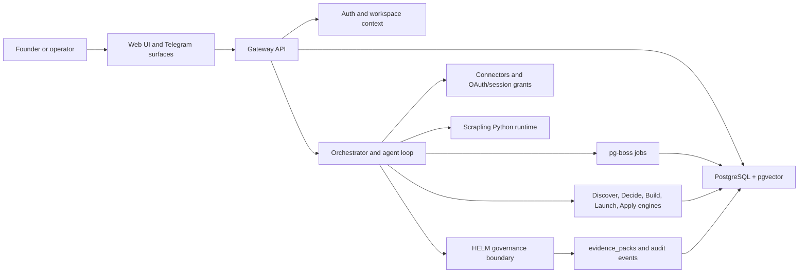

# Pilot Architecture

Pilot is a self-hostable founder operating system built around a gateway, orchestrator, workspace memory, founder workflow engines, connector surfaces, Scrapling-backed ingestion, and a HELM governance boundary for consequential actions.

## Audience

Use this page if you are a developer, operator, or evaluator who needs to understand the public architecture before self-hosting or extending Pilot. It avoids internal planning language and focuses on the current service boundaries.

## Outcome

After this page you should be able to:

- identify the gateway, web UI, orchestrator, database, job queue, connectors, ingestion runtime, and HELM sidecar;
- explain how founder workflows move through tasks, operators, approvals, and audit records;
- understand where Scrapling and browser session capture fit;
- know which actions should produce receipts or denials;
- choose the right reference page for APIs, environment variables, security, or integrations.

## System Map

## Source Truth

Architecture claims are backed by:

- `services/gateway/`
- `services/orchestrator/`
- `services/launch-engine/`
- `packages/db/src/schema/`
- `packages/helm-client/`
- `packages/connectors/`
- `pipelines/requirements.txt`
- `scripts/install-python-runtime.sh`
- `docs/helm-integration.md`
- `docs/security.md`

If code, schema, or deployment files disagree with this page, the source artifact wins.

## Gateway

The gateway is the public HTTP boundary for auth, workspaces, tasks, connectors, governance status, launch surfaces, YC ingestion routes, audit, and health. It owns request authentication, workspace context, rate limiting, secure headers, and route-level validation.

## Orchestrator

The orchestrator runs founder tasks and agent loops. It receives workspace context, model configuration, policy configuration, and connector grants. It is where Pilot turns a founder goal into an executable plan, tool calls, approvals, artifacts, and audit entries.

## Memory And Truth

PostgreSQL with pgvector is the durable system of record. It stores workspaces, members, tasks, operators, knowledge, applications, connector grants, audit events, approvals, task runs, evidence packs, launch records, and ingestion metadata. pgvector supports knowledge and opportunity search; keyword search remains available when embedding providers are absent.

## Engines

Pilot's founder-facing modes are product journeys, not separate products:

| Mode | Output Shape |
| --- | --- |
| Discover | opportunities, research notes, knowledge pages, scored signals |
| Decide | decision artifacts, comparison tables, evidence-backed recommendations |
| Build | tasks, specs, implementation plans, generated artifacts |
| Launch | deploy targets, launch checklists, support-bot workflows |
| Apply | application drafts, program tracking, review artifacts |

## Scrapling Ingestion

Scrapling-backed ingestion runs through a local Python runtime. It supports public YC ingestion, session-backed founder-authorized syncs, replay of stored captures, and adaptive selector storage. Browser session material is encrypted and treated as sensitive operator data; public docs should explain the mechanism without exposing private session content.

## HELM Governance Boundary

HELM is the policy and receipt boundary for LLM inference and non-trivial external actions in production. Pilot's local trust boundary can pre-check kill switches, budgets, blocklists, connector scope, and approval requirements, but production allows should be backed by HELM decisions where configured.

## Troubleshooting

| Symptom | Likely Cause | Fix |
| --- | --- | --- |
| architecture page disagrees with routes | service changed without docs update | check `services/gateway/src/routes` and update docs |
| task runs but no audit event appears | orchestrator path bypassed persistence | inspect `task_runs`, `audit_events`, and route wiring |
| ingestion works locally but not in Docker | Python/browser runtime mismatch | verify `PYTHON_BIN`, Playwright, and Patchright paths |
| HELM receipts are absent | sidecar or `HelmClient` is not configured | check `HELM_GOVERNANCE_URL` and startup logs |

