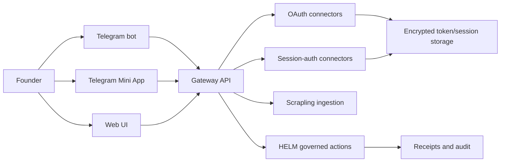

# Integrations

Pilot integrations connect founder workflows to Telegram, Telegram Mini App, OAuth providers, session-auth connectors, Scrapling ingestion, and HELM governance. This landing page explains the public integration surface and links to deeper pages.

## Audience

Use this page if you are enabling external systems, reviewing connector boundaries, or deciding which integration to configure first. It is written for founder/developers and self-hosting operators.

## Outcome

After this page you should know:

- which integrations are required for a minimal local install;
- how Telegram bot and Mini App surfaces relate to the gateway;
- how OAuth and session-auth connector grants are stored;
- where YC session capture is safe to discuss publicly;
- where HELM fits as a governance boundary rather than a product name.

## Integration Map

## Source Truth

Integration docs are backed by:

- `docs/telegram-miniapp-8.md`
- `docs/helm-integration.md`
- `docs/env-reference.md`
- `docs/security.md`
- `services/gateway/src/routes/connectors*`
- `services/gateway/src/services/managed-telegram-bots.ts`
- `packages/connectors/`
- `packages/helm-client/`
- `docs/ingestion/scrapling-v045.md`

If code and docs disagree, update this page and the deeper integration page together.

## Minimal Local Install

For the first local run, the only required integration is the database. You can add direct LLM provider keys for local development or configure HELM if you want the production governance shape. Telegram, OAuth connectors, YC session capture, S3 storage, Sentry, and external email are optional until the workflow needs them.

## Telegram Bot

Telegram bot support is enabled with `TELEGRAM_BOT_TOKEN` and, in production webhook mode, `TELEGRAM_WEBHOOK_SECRET`. The bot can route commands into Pilot workflows and approval notifications. Managed launch/support bots are created through Telegram Managed Bots and persisted workspace-by-workspace.

## Telegram Mini App

The Mini App is served from the gateway and should point BotFather to `https://your-domain.com/app/`. It is useful when founders want a lightweight mobile surface for modes, approvals, launch support, and governed task status.

## OAuth Connectors

OAuth connectors such as GitHub, Gmail, and Google Drive use provider-specific client IDs, secrets, callback URLs, and encrypted token storage. Connector grants are workspace-scoped. Production deployments should set explicit redirect URIs and rotate secrets with the security guide.

## Session-Auth Connectors

The YC connector uses founder-authorized browser session capture rather than OAuth. Public docs may explain the shape: the founder grants a connector, saves a browser storage-state snapshot, validates it, and Pilot stores it encrypted at rest. Public docs should not expose private session data, matching results, or personal material.

## Scrapling Ingestion

Scrapling runs in a pinned Python runtime with Playwright and Patchright browser caches. Use it for public ingestion, replay of stored captures, and session-backed syncs when the connector is valid.

## HELM Governance

HELM governs non-trivial external actions and LLM inference in production. Use [HELM Integration](helm-integration.md) for sidecar, receipt, fail-closed, and environment details.

## Troubleshooting

| Symptom | Likely Cause | Fix |
| --- | --- | --- |
| Telegram webhook returns unauthorized | secret token mismatch | set Telegram webhook secret and `TELEGRAM_WEBHOOK_SECRET` to the same value |
| OAuth callback fails | redirect URI mismatch | register the exact callback URL from env reference |
| connector says granted but cannot act | token or session validation failed | revalidate grant and inspect encrypted storage health |
| Scrapling fetch fails | browser runtime missing | rerun `scripts/install-python-runtime.sh` |
| governed action is denied | HELM policy or approval gate blocked it | inspect receipt, reason code, and policy bundle |

