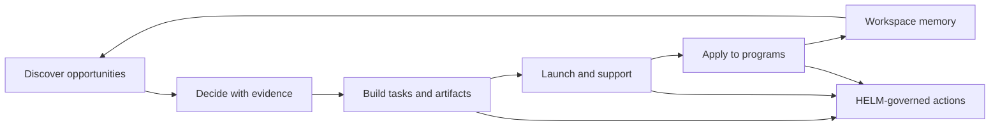

# Product

Pilot is a self-hostable founder operating system for discovery, decision, build, launch, and application workflows. It is not positioned as a generic coding agent or broad customer-support agent. The product shape is a governed operating loop for founders who need useful work, evidence, and approval boundaries in the same system.

## Audience

Use this page if you are evaluating Pilot as a product, building a founder workflow, writing public copy, or deciding whether a feature belongs in user guidance or operator guidance.

## Outcome

After this page you should be able to:

- explain the five founder journeys: Discover, Decide, Build, Launch, and Apply;
- identify what artifact each journey should produce;
- separate founder user guidance from self-hosting operator guidance;
- explain why Pilot uses HELM for governance without making HELM part of the product name;
- compare Pilot to general-purpose autonomy without drifting into unsupported claims.

## Founder Workflow Map

## Source Truth

Product guidance is backed by:

- `README.md`
- `docs/roadmap.md`
- `docs/api.md`
- `services/orchestrator/`
- `services/launch-engine/`
- `services/gateway/src/routes/launch.ts`
- `packages/db/src/schema/`
- `packs/founder_ops.v1.json`
- `docs/helm-integration.md`

Product language should stay grounded in working routes, schema, tasks, artifacts, approvals, and receipts.

## Founder Journeys

| Journey | Founder Job | Expected Output |
| --- | --- | --- |
| Discover | find and organize opportunities | scored opportunities, knowledge pages, research notes |
| Decide | make a high-stakes choice with evidence | decision artifact, comparison table, recommendation, audit trail |
| Build | turn a goal into implementation work | tasks, specs, code or artifact plan, governed commits where configured |
| Launch | prepare deployment and go-to-market work | deploy target, launch checklist, support-bot setup, health records |
| Apply | draft and manage application material | application record, draft sections, status updates, review history |

## Founder Guidance Vs Operator Guidance

Founder guidance should focus on workflows, decisions, artifacts, and approvals. Operator guidance should focus on Docker, Postgres, env vars, backups, security, integrations, and uptime. When a page mixes both, split it or move the operational material into [Self-Hosting](../self-hosting.md).

## Governance Positioning

Pilot uses HELM as the governance boundary for consequential actions. Public product copy should say "Pilot" for the product and "HELM" only when describing policy evaluation, receipts, sidecar deployment, or trust-boundary behavior.

## Contrast With Generic Autonomy

| Surface | Pilot | General-purpose autonomy |
| --- | --- | --- |
| Primary user | founder/operator | broad user or enterprise admin |
| Workflow shape | Discover, Decide, Build, Launch, Apply | open-ended task execution |
| Deployment | self-hostable stack | often vendor-hosted |
| Governance | HELM decisions, approvals, evidence packs | product-specific logs |
| Memory | workspace-scoped founder data | runtime-specific memory model |

## Troubleshooting

| Symptom | Likely Cause | Fix |
| --- | --- | --- |
| product copy says too much | claim is not backed by routes or schema | link it to source truth or remove it |
| founder docs mention deployment internals | operator content leaked into user guidance | move it to self-hosting |
| operator docs describe workflows vaguely | product content is missing expected outputs | add artifacts and success criteria |
| HELM appears as product branding | rename work is incomplete | use Pilot for product name and HELM only for governance |

