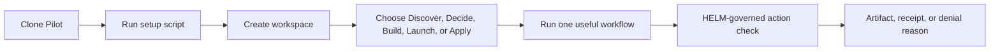

# Start With Pilot

Pilot is a self-hostable founder operating system for discovery, decision, build, launch, and application workflows. This start path gets a founder/developer from a clean checkout to one useful governed workflow without forcing them to understand every operator concern first.

## Audience

Use this page if you are a founder, solo developer, or technical evaluator who wants to run Pilot locally, create a workspace, connect the minimum required services, execute one useful workflow, and see what crosses the HELM governance boundary.

## Outcome

At the end you should have:

- a local Pilot gateway and web UI;
- PostgreSQL with pgvector running;
- a workspace you can authenticate into;
- one task or workflow queued through Pilot;
- a clear distinction between founder guidance and operator/self-hosting guidance;
- one governed action that produces an allow, deny, escalation, or health signal from the HELM path when configured.

## First Workflow Path



## Source Truth

This onboarding page is backed by:

- `docs/self-hosting.md`
- `docs/env-reference.md`
- `docs/api.md`
- `docs/helm-integration.md`
- `docs/security.md`
- `services/gateway/`
- `services/orchestrator/`
- `packages/db/`
- `packs/founder_ops.v1.json`

If a command here differs from setup scripts or service code, update this page.

## 1. Install The Minimal Stack

```bash
git clone https://github.com/Mindburn-Labs/pilot.git
cd pilot
bash scripts/setup.sh
```

The setup script checks prerequisites, generates local secrets, starts the database, runs migrations, and tests the API. The gateway runs on port `3100`; the web UI runs on port `3000`.

For local development without Docker, use the operator-focused [Self-Hosting](self-hosting.md) page.

## 2. Verify Runtime Health

```bash
curl http://localhost:3100/health | jq
```

Expected output includes overall status and checks for the database and job queue. If HELM is configured, health should also show whether the governance sidecar is reachable.

## 3. Create Or Enter A Workspace

Use the web UI or auth API to create a workspace. Workspace context is the unit for tasks, operators, connector grants, approvals, audit events, and budget policy.

For API-driven setup, request and verify an email code:

```bash
curl -sS -X POST http://localhost:3100/api/auth/email/request \
  -H 'Content-Type: application/json' \
  -d '{"email":"founder@example.com"}' | jq
```

Development mode may return a code directly. Production should send it through the configured email provider.

## 4. Run One Useful Workflow

Start with a low-risk task:

- Discover: score an opportunity or search knowledge.
- Decide: compare options and produce a decision artifact.
- Build: create a structured task or implementation plan.
- Launch: create a deploy target or launch checklist artifact.
- Apply: draft an application section for review.

For a simple API smoke:

```bash
curl -sS http://localhost:3100/api/product/modes | jq
```

Then create a task from the UI or `POST /api/tasks` with a workspace ID.

## 5. Understand The Governed Action

Pilot can run with direct providers for local development, but production should route through HELM. When `HELM_GOVERNANCE_URL` and `HELM_FAIL_CLOSED=1` are set, LLM inference and consequential tool execution are expected to pass through the HELM boundary.

You should see one of four outcomes:

| Outcome | Meaning |
| --- | --- |
| allow | action passed policy and may execute |
| deny | action was blocked with a reason |
| escalate | approval is required before execution |
| unreachable/degraded | HELM is required but unavailable, so Pilot fails closed |

## Founder Vs Operator Docs

| Need | Page |
| --- | --- |
| run the first workflow | this page |
| operate Docker, Postgres, backups, and upgrades | [Self-Hosting](self-hosting.md) |
| inspect API groups and payloads | [API Reference](api.md) |
| understand governance boundary | [HELM Integration](helm-integration.md) |
| harden secrets, sessions, and connectors | [Security](security.md) |

## Troubleshooting

| Symptom | Likely Cause | Fix |
| --- | --- | --- |
| setup script fails on prerequisites | Docker, Node, or Python runtime is missing | install prerequisites and rerun the setup script |
| `/health` reports database failure | PostgreSQL is stopped or `DATABASE_URL` is wrong | start the compose database and check env reference |
| task completes without useful output | no LLM provider or HELM upstream is configured | configure HELM for production or direct provider keys for local development |
| governed action fails closed | HELM is required but unreachable | check `HELM_GOVERNANCE_URL`, `HELM_HEALTH_URL`, and sidecar logs |
| Telegram workflow does not respond | bot token or webhook is missing | use the integrations page and Telegram setup steps |

